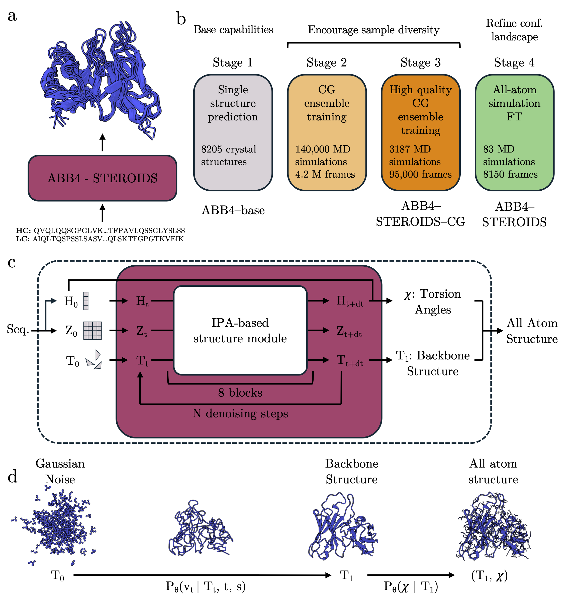

# ABB4-STEROIDS: Antibody Conformational Ensemble Prediction

ABB4-STEROIDS is a generative structure prediction model for sampling **conformational ensembles** of antibodies rather than a single static structure. Conformational flexibility is central to antibody behavior, but exhaustive molecular dynamics (MD) is often expensive and many deep-learning methods focus on one structure at a time. This repository provides workflows for training, testing, and inference, built around large-scale simulation data (coarse-grained and all-atom trajectories), using flow matching on SE(3) to generate diverse antibody conformations.

<p align="center">
  
</p>
<p align="center"><em>Overview of the ABB4 models. a) ABB4-STEROIDS generates an ensemble of antibody structures for a given input sequence. b) Summary of the four-stage training procedure. c) Illustration of the model architecture. d) Diagram providing an overview of the flow matching methodology. H: single/node representation. Z: pair/edge representation. T: backbone frames. χ: torsion angles. Subscripts denote the flow matching time step.</em></p>

## Table of Contents
- [Installation](#installation)
- [Running Inference](#running-inference)
- [Analysis](#post-processing--analysis)
- [Training Models](#training-models)
- [Repository Layout](#repository-layout)
- [Citation](#citation)
---

## Installation

**Requirements**: Conda, Python 3.10, CUDA >= 12.6.

```bash
bash scripts/install.bash
```

This creates a conda environment `abb4_env`, installs PyTorch 2.8.0 + all dependencies, and installs the local package.

The script automatically detects your installed CUDA version via `nvidia-smi` and selects the best matching wheel from the following supported tags (in descending preference):

| CUDA version | Wheel tag |
|---|---|
| 12.9 | `cu129` |
| 12.8 | `cu128` |
| 12.6 | `cu126` |

If your CUDA version falls between two entries, the next lower tag is used (e.g. CUDA 12.7 → `cu126`). The script will print the selected tag and ask for confirmation before installing.

**If installation fails**, you can override the CUDA tag manually by editing the two pip lines in `scripts/install.bash` directly:
```bash
pip install torch==2.8.0 --index-url https://download.pytorch.org/whl/<CUDA_TAG>
pip install torch-scatter -f https://data.pyg.org/whl/torch-2.8.0+<CUDA_TAG>.html
```
replacing `<CUDA_TAG>` with the appropriate tag from the table above.

---

## Running Inference

### 1. Create an input CSV

Create a CSV file with one row per antibody. The following columns are required:

| Column | Description |
|--------|-------------|
| `pdb_name` | Name/identifier for the query antibody |
| `VH_seq` | VH (heavy chain) sequence |
| `VL_seq` | VL (light chain) sequence |

Example:

```csv
pdb_name,VH_seq,VL_seq
my_antibody,EVQLVESGGGLVQPGGSLRLSCAAS...,DIQMTQSPSSLSASVGDRVTITC...
```

### 2. Edit the inference config

Open `abb4/configs/inference.yaml` and set the following key parameters:

```yaml
data:
  module:
    loaders:
      num_workers: 10           # CPU workers for data loading; set to number of available CPUs if lower

  dataset:
    predict:
      csv_path: /path/to/input.csv   # path to your input CSV (created above)
      num_samples: 100               # number of structure to sample per antibody
      pred_sampler:
        batch_size: 100              # recommended for A100 (80GB), reduce if required

interpolant:
  sampling:
    num_timesteps: 100               # ODE steps during inference
                                     # 100 matches publication accuracy; 50 gives idenitcal accuracy with ~2x speedup

experiment:
  num_devices: 1                     # number of GPUs to use
  prediction:
    ckpt_path: ckpt/abb4_STEROIDS/abb4_STEROIDS.ckpt  # which model to use (see options below)
    output_dir: /path/to/output/dir  # where generated PDB files are written
```

**Available checkpoints** (`ckpt_path`):

| Checkpoint | Description |
|------------|-------------|
| `ckpt/abb4_STEROIDS/abb4_STEROIDS.ckpt` | **(default)** Full model trained on CG + all-atom MD — best for conformational ensemble sampling |
| `ckpt/abb4_base/abb4_base.ckpt` | Trained on experimental structures only — use for single-structure prediction |
| `ckpt/abb4_STEROIDS_CG/abb4_STEROIDS_CG.ckpt` | Trained on CG MD only (no all-atom fine-tuning) — conformational sampling without all-atom refinement |

### 3. Run inference

Set `--nproc_per_node` to match `experiment.num_devices` in the config.

```bash
# Multi-GPU
bash scripts/inference.bash --nproc_per_node 4 --master_port 29500

# Single GPU
bash scripts/inference.bash --nproc_per_node 1
```

### 4. Outputs

```
<output_dir>/
  sample_config.yaml                       # config snapshot for reproducibility
  <target_name>/
    sample_0.pdb                           
    ...
    sample_100.pdb
```

### 5. Post-processing: IMGT renumbering (recommended)

Convert predicted PDBs to standard IMGT antibody numbering:

```bash
python scripts/renumber_predictions.py \
  --pred_path /path/to/output/dir \
  --out_path /path/to/output/dir_imgt \
  --gpu
```


## Analysis

Scripts are provided to perform preliminary analysis of the predicted ensembles. RMSF and RMSD values can be calculated:

```bash
# Calculate CDR RMSD statistics across ensemble
python scripts/calculate_cdr_rmsds.py \
  --pred_path /path/to/output/dir_imgt \
  --n_jobs 20
# Output: /path/to/output/dir_imgt/cdr_rmsds.csv

# Calculate per-residue RMSF (flexibility) across ensemble
python scripts/calculate_cdr_rmsfs.py \
  --pred_path /path/to/output/dir_imgt
# Output: /path/to/output/dir_imgt/cdr_rmsfs.csv
```

---
---

## Training Models

### 1. Prepare training data

**Create `.pkl` files from PDB structures** using the preprocessing script:

```bash
python abb4/data/preproc/process_ab_pdb_files.py
```

This processes raw antibody PDB files into the pickle format expected by the dataloader.

**Create a metadata CSV** pointing to those `.pkl` files. Template CSVs with the expected columns and format are provided in `data/`.

### 2. Edit the training config

Open `abb4/configs/data.yaml` and `abb4/configs/experiment.yaml` and set the following key parameters:

| Parameter | Config file | Key | Description |
|-----------|------------|-----|-------------|
| Training data CSV | `data.yaml` | `data.dataset.train_val_test_pdbs.csv_path` | Path to your metadata CSV |
| Batch size | `data.yaml` | `data.module.loaders.train.single_struc_sampler.batch_size` | Per-GPU batch size; reduce if OOM |
| Number of GPUs | `experiment.yaml` | `experiment.num_devices` | Number of GPUs for DDP training |
| W&B logging | `experiment.yaml` | `experiment.wandb` | Set project/group or disable logging |

### 3. Run training

Set `--nproc_per_node` to the number of GPUs you wish to use.

```bash
python -W ignore -m torch.distributed.run --nproc_per_node=<num_gpus> --master_port=12355 abb4/experiments/training_validation.py -cn training
```

---


## Repository Layout

```
ABB4/
├── abb4/
│   ├── configs/        # Hydra YAML configs
│   ├── data/           # DataModule, datasets, Interpolant, preprocessing
│   ├── experiments/    # Entrypoints + ModelRun orchestrator
│   ├── models/         # FlowModel, FlowModule (Lightning), losses
│   └── analysis/       # PDB I/O utilities
├── openfold/           # Bundled OpenFold (IPA, rigid body ops)
├── scripts/            # Operational scripts
├── ckpt/               # Model checkpoints
├── predictions/        # Inference outputs
├── data/               # Dataset CSVs
└── notebooks/          # Example notebooks
```

---

## Citation

If you use ABB4-STEROIDS in your work, please cite the associated manuscript.


This repository builds on the [FrameFlow](https://github.com/microsoft/protein-frame-flow) codebase.
